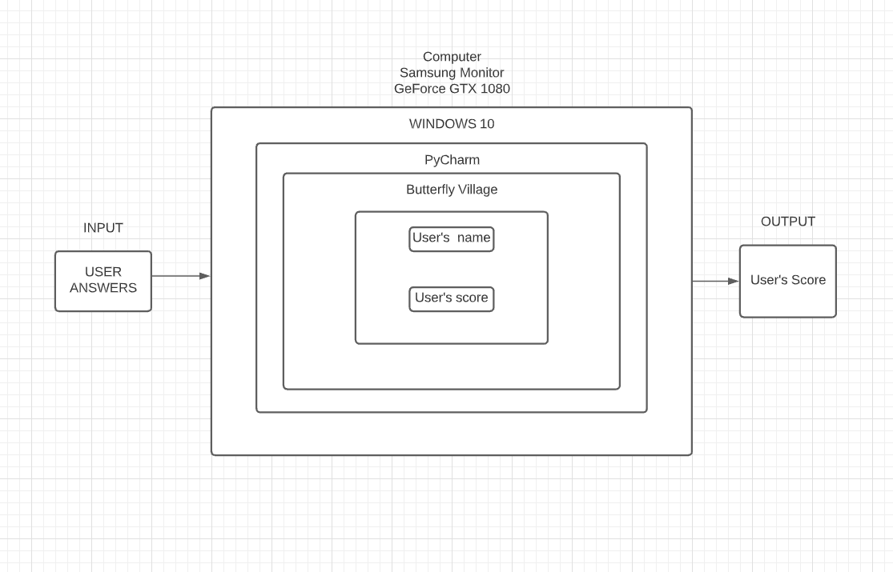
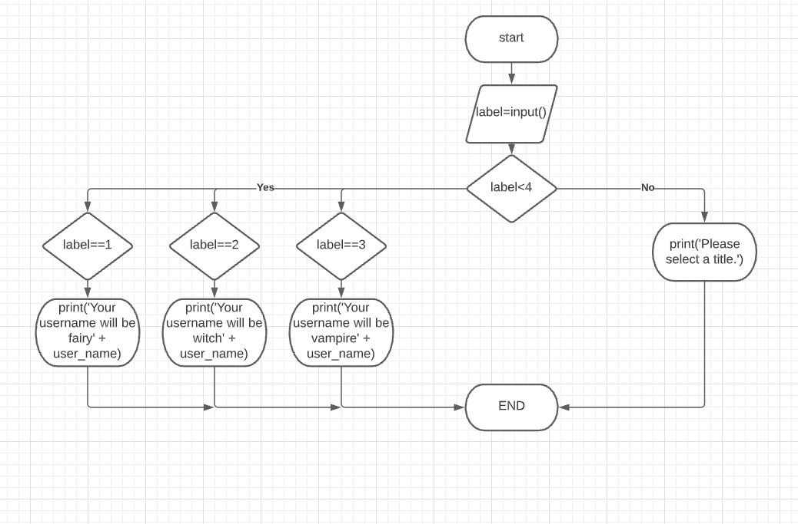
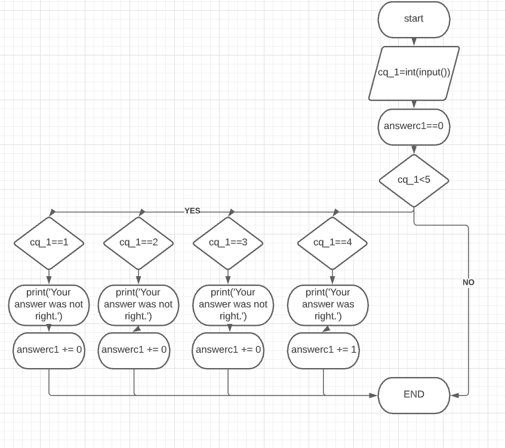
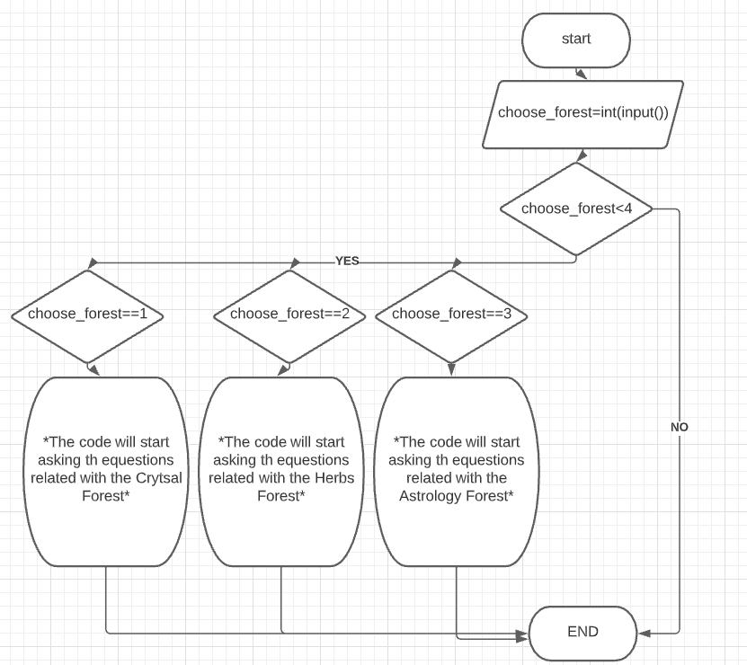

# Unit 1: A classic game 

# Criteria A: Planning

## Problem definition

The owner of the local game shop is an enthusiast of classic computer games. He has been looking for a talented programmer that can help him revive his passion for text-based games. He has few requirements for this task:

1. The game has to be entirely text-based.
2. The game must record the time played.
3. The game must record the player name and score.
4. The game should include emoticons, emojis or ascii images for visual purposes.
5. The game should be easy to understand and play.
6. The game should be visually pleasing.

Apart for this requirements, the owner is open to any type of game, topic or genre.

## Proposed Solution

I will design a text based game for a client who is interested in tasting their abilites. The text game will be about testing the user's ability ability in witch rituals, crystals,herbs and astrology and is constructed using the software evaluated according to the criteria shown below.

## Success Criteria
1. The game has to be entirely text-based.
2. The game must record the time played.
3. The game must record the player name and score.
4. The game must have verified info (including the crystals ).
5. The game must have a scoreboard at the end of the game showing the player's name and score.

# Criteria B: Design

## System Diagram

## Flow Diagrams

## Record of Tasks
| Task No | Planned Action | Planned Outcome | Time estimate | Target completion date | Criterion |
|---------|----------------|-----------------|---------------|------------------------|-----------|
|    1     |      Planning how the game will go, which topics I want to include and what vibe I want my game to give.         | I have a general idea of how I want my game to be about, the storyline and the vibe that I want my game to give.                |  1-2 days           |    27 September 2021                      |           |
|    2    |         Searching for ASCII images, emoticons and emojis that I can use in my game to make it look more visually pleasing .    |  Finding out that I don't want to add any ASCII images or emoticons to my game since they don't fit the aesthetic of the game and one of the goals is the game to be visually satisfying.               |1 day               |       2 October 2021                  |          |
|      3   |    Starting to write the beginning part of the code where it asks for user's name .      |  Having a basic intro to how my game will look like .               |       3 days         |   7 October 2021                    |      |
|    4   |         Learning some user-friendly psychological tricks that I can use in my game.  | Adding the 'user-title' part to my game to have give some optional parts in the game to the user which I've realised while researching that helps the user to connect to the product more.                |   1 day             |   10 October 2021                     |           |
|    5    |       Making detailed research on the three topics that I will be using in my game(crystals,herbalogy,astrology)  |  Finding out there there were a lot of opportunities that I can write questions.               |  1 day            |         12 October 2021               |           |
|    6    |         Writing the questions that I will use in the game.    |  Changing my idea of having 10 questions to 5 questions because along the way I've realised that if I have 10 questions it will cover too many topics that an average user might not know which is not a good thing if we think from user's point of view.               |              2-3 days   |    20 October 2021                 |         |
|    5    |          Grading the questions that I've wrote and listing them easy to hard.    | Having 5 question which all have different levels of easiness.                |      1 day           |     21 October 2021                    |          |
|    6     |         Adding the questions that I wrote to the code.      | My game nearly finishes with all the questions and the extra intro parts.                |             2 days     |     25 October 2021                 |         |
|    7    |         Ending the game.    |                 |               |        25 October 2021                |               |
|    8     |          Doing flowcharts and system diagram.      |                 |   3-4 hours              |  27 October 2021                    |          |
